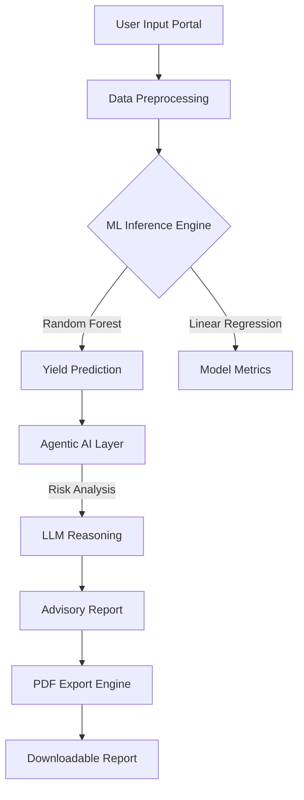
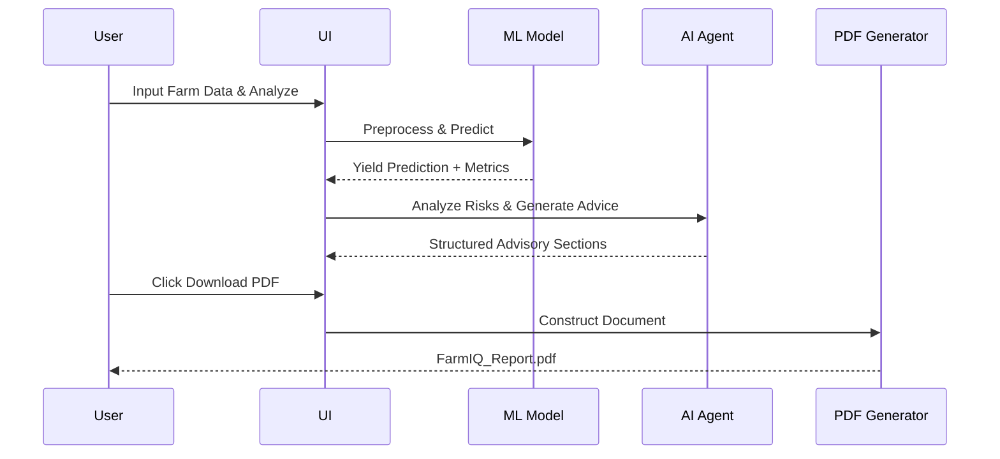

# 🌾 FarmIQ: Intelligent Crop Yield & Agentic Advisory System

FarmIQ is a professional-grade agricultural intelligence platform that combines **Machine Learning (ML)** for precise yield forecasting with **Agentic AI** to provide actionable farming advisory reports.

## 🌟 Key Features

- **Precision Yield Forecasting**: Ensemble ML models (Random Forest & Linear Regression) predict crop yield based on environmental factors.
- **Agentic AI Advisory**: A specialized LLM agent analyzes predictions and identifies risk factors (drought, thermal stress, nutrient gaps).
- **Professional UI/UX**: A modern, agricultural-themed dashboard built with Streamlit, featuring glassmorphism and intuitive card-based inputs.
- **PDF Report Export**: Generate and download comprehensive agronomy reports in PDF format for offline record-keeping.
- **Risk Mitigation**: Automated identification of environmental hazards with specific recommended actions.

---

## 🏗️ System Architecture



---

## 🔄 Platform Workflow

To get the most out of FarmIQ, follow this logical flow:

1.  **Data Entry**: Provide details about your crop (type, season), local weather (rainfall, temp), soil nutrients (N, P, K), and farm management (irrigation, area).
2.  **Analysis**: Click **"Analyze"** to trigger the ML engine and AI reasoning agent.
3.  **Review Results**: 
    -   Observe the **Predicted Yield** (tons/ha) and its productivity level (High/Medium/Low).
    -   Examine the **Driving Environmental Factors** chart to understand what impacted your yield.
    -   Read the **Strategic Agro-Advisory** sections for risks and recommended actions.
4.  **Export Data**: Click **"Download Professional Report"** to save all analysis results, risks, and recommendations as a PDF. **Note: Data is not saved on the platform after you close the session.**



---

## 🛠️ Installation & Setup

### 1. Environment Setup
```bash
# Clone the repository
git clone https://github.com/Amaan-pathan/Crop-Yield-Advisory.git
cd Crop-Yield-Advisory

# Create and activate virtual environment
python3 -m venv venv
source venv/bin/activate
```

### 2. Install Dependencies
```bash
pip install -r requirements.txt
```

### 3. Run the Platform
```bash
streamlit run app.py
```

---

## 💾 Technical Stack

- **Frontend**: Streamlit (with custom CSS & JS injection)
- **Machine Learning**: Scikit-Learn (Random Forest, Linear Regression)
- **AI Agent**: HuggingFace Transformers (Flan-T5) / Agentic logic
- **Visualizations**: Plotly Express
- **Document Engine**: FPDF2
- **Data Handling**: Pandas, Numpy

---

## ⚖️ Disclaimer

**FarmIQ** is an AI-driven advisory tool. Predictions and recommendations are based on historical data patterns and generalized agronomy principles. Users should consult with a certified regional agronomist or soil specialist before making significant financial or operational farming decisions.

---

## 👥 Contributors

- **Pathan Amaan** (Lead Developer & UI/UX Designer)
- **Saad Arqam**
- **Priyabrata Singh**
- **Manu Pal**
